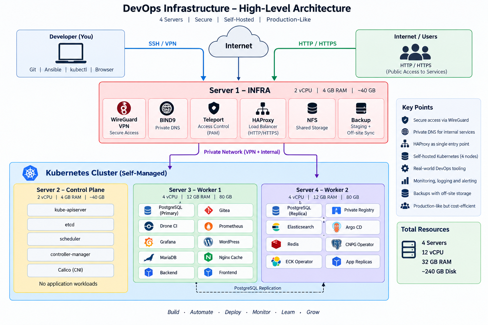

# Production DevOps Platform

A production-like DevOps infrastructure project built from an SRS.

The goal of this project is to design, deploy, automate and monitor
a complete self-hosted platform using modern DevOps practices.

## Architecture

The infrastructure consists of four servers:

| Node | Role | CPU | RAM |
|---|---|---:|---:|
| infra-01 | Infrastructure Services | 2 vCPU | 4 GB |
| k8s-cp-01 | Kubernetes Control Plane | 2 vCPU | 4 GB |
| k8s-worker-01 | Kubernetes Worker | 4 vCPU | 12 GB |
| k8s-worker-02 | Kubernetes Worker | 4 vCPU | 12 GB |

### High-Level Architecture

## Core Technologies

- Linux
- Ansible
- WireGuard
- BIND9
- HAProxy
- Kubernetes
- containerd
- Calico
- Gitea
- Drone CI
- Argo CD
- Private Docker Registry
- CloudNativePG
- PostgreSQL
- Redis
- Prometheus
- Grafana
- Alertmanager
- Elasticsearch
- Logstash
- Kibana
- Velero
- NFS

## Project Status

### Phase 1 — Infrastructure

- [x] Architecture design
- [x] Provision infrastructure server
- [x] Provision Kubernetes control plane
- [x] Configure base operating system
- [x] Configure Ansible
- [x] Configure WireGuard VPN
- [x] Configure private DNS
- [x] Configure firewall

### Phase 2 — Kubernetes

- [x] Bootstrap Kubernetes control plane
- [x] Join Worker 1
- [x] Join Worker 2
- [x] Install Calico
- [x] Configure Network Policies

### Phase 3 — Platform Services

- [ ] Gitea
- [ ] Drone CI
- [x] Private Container Registry
- [x] Argo CD
- [x] PostgreSQL
- [x] Redis

### Phase 4 — Observability

- [ ] Prometheus
- [ ] Grafana
- [ ] Alertmanager
- [ ] ELK Stack

### Phase 5 — Backup & Recovery

- [ ] Backup strategy
- [ ] Retention policy
- [ ] Restore testing

## Documentation

Detailed architecture decisions and implementation documentation
are available in the `docs/` directory.
